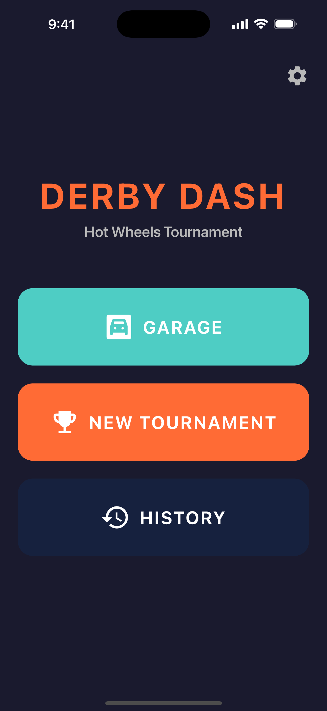
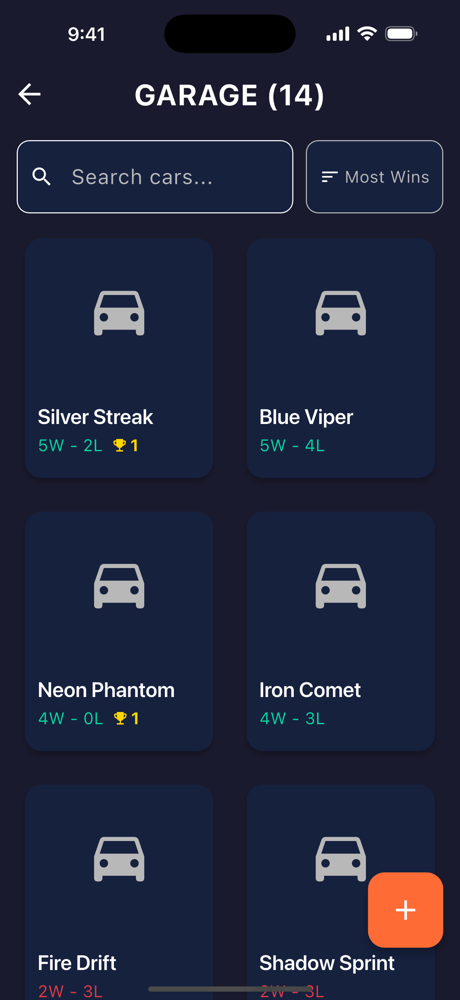
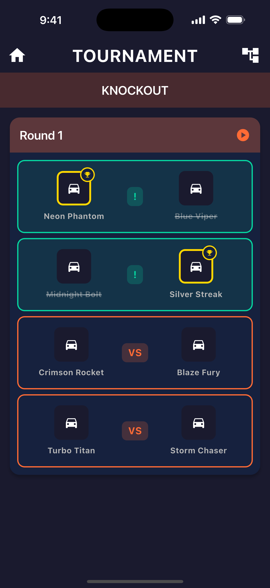
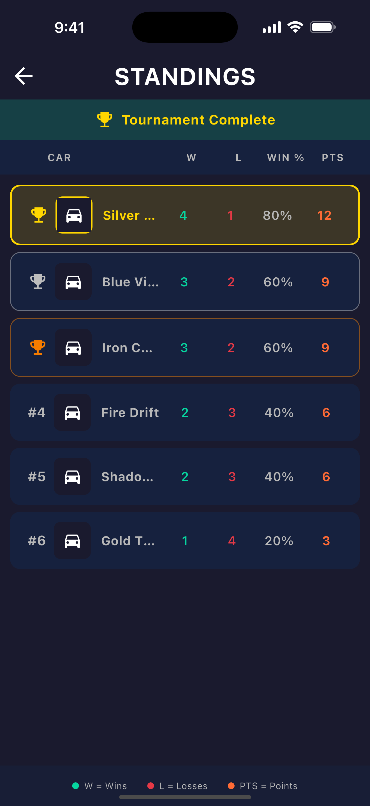

# Derby Dash

A local-first, offline-capable Flutter app for managing Hot Wheels car tournaments. Built with a "Kid-First" design philosophy featuring high-contrast UI, large touch targets, and resilience to accidental taps.

## Features

- **Car Garage**: Add and manage your Hot Wheels collection with photos
- **Multiple Tournament Types**:
  - Single Elimination (Knockout)
  - Round Robin
  - Group Stage + Knockout
- **Best-of-X Series**: Configure multi-race matches for more competitive tournaments
- **Live Bracket View**: Visual tournament progression with real-time updates
- **Match History**: Track wins, losses, and tournament championships
- **Fully Offline**: No internet connection required - all data stored locally

## Screenshots

| Home | Garage | Dashboard | Standings |
| --- | --- | --- | --- |
|  |  |  |  |

Generate or refresh screenshots:

```bash
./tool/ios/capture_simulator_screenshots.sh
```

Generate Android Play Store screenshots:

```bash
./tool/android/capture_emulator_screenshots.sh
```

Automation docs:

- iOS: [IOS_SCREENSHOT_AUTOMATION.md](IOS_SCREENSHOT_AUTOMATION.md)
- Android: [ANDROID_SCREENSHOT_AUTOMATION.md](ANDROID_SCREENSHOT_AUTOMATION.md)

## Getting Started

### Prerequisites

- [Flutter](https://docs.flutter.dev/get-started/install) (3.0 or higher)
- iOS Simulator, Android Emulator, or physical device

### Installation

1. Clone the repository:
   ```bash
   git clone https://github.com/lucakaufmann/derby-dash.git
   cd derby-dash
   ```

2. Install dependencies:
   ```bash
   flutter pub get
   ```

3. Generate Isar schemas and Riverpod code:
   ```bash
   flutter pub run build_runner build --delete-conflicting-outputs
   ```

4. Run the app:
   ```bash
   flutter run
   ```

### Build Commands

```bash
# Run in debug mode (requires debugger connection)
flutter run

# Run standalone (profile mode)
flutter run --profile

# Run production build
flutter run --release

# Run tests
flutter test

# Analyze code
flutter analyze
```

### Google Play Upload Automation

This repo includes Fastlane + GitHub Actions automation for Play uploads.

Local one-command upload to Internal testing:

```bash
bundle install
# First time setup:
cp .env.example .env
# Then edit .env and set GOOGLE_PLAY_JSON_KEY_PATH
./tool/android/upload_play_internal.sh
```

Manual CI upload from GitHub Actions:

1. Add repository secret `PLAY_SERVICE_ACCOUNT_JSON` with the full JSON key content.
2. Run workflow: `.github/workflows/google-play-upload.yml`.
3. Choose `internal` or `production` track in workflow dispatch.

Play Console/API requirements:

- Create a Google Cloud service account with Android Publisher API enabled.
- In Play Console, grant that service account app access (Release manager or Admin).
- Use the same app package name configured in Android: `com.codable.derbydash`.

## Architecture

Derby Dash follows a clean architecture with clear separation of concerns:

```
lib/
├── data/
│   └── models/          # Isar database models
├── providers/           # Riverpod state management
├── screens/
│   ├── garage/          # Car management screens
│   ├── match/           # Match gameplay screen
│   ├── settings/        # App settings
│   └── tournament/      # Tournament flow screens
├── services/            # Business logic
└── widgets/             # Reusable UI components
```

### Tech Stack

- **Framework**: Flutter (Dart)
- **Database**: [Isar](https://isar.dev/) - Fast, local NoSQL database
- **State Management**: [Riverpod](https://riverpod.dev/) with code generation
- **Image Handling**: `image_picker` + `image_cropper`

### Data Models

- **Car**: Individual Hot Wheels cars with photos and soft-delete support
- **Tournament**: Competition container with status tracking
- **Round**: Groups matches within a tournament
- **Match**: Individual race between two cars

## Contributing

Contributions are welcome! Please read our [Contributing Guidelines](CONTRIBUTING.md) before submitting a pull request.

## License

This project is licensed under the MIT License - see the [LICENSE](LICENSE) file for details.

## Acknowledgments

- Built for Hot Wheels enthusiasts and their kids
- Inspired by the joy of racing toy cars
